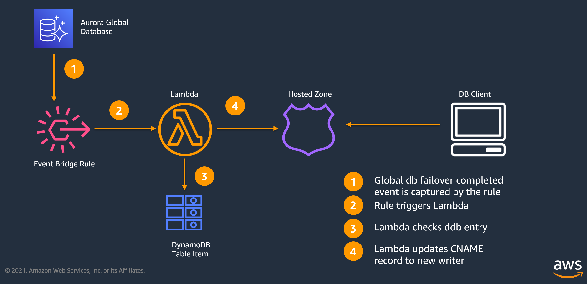

# Automated endpoint management for Amazon Aurora Global Database

This solution includes a cloudformation template and a python script. This document will describe how to use this solution. 

Detailed documentation of this solution is published as blog and available by following the link below.
https://aws.amazon.com/blogs/database/automate-amazon-aurora-global-database-endpoint-management

## Architecture


```bash
.
├── README.MD                   <-- This readme instructions file
├── managed-gdb-cft.yml         <-- Cloudformation template
├── buildstack.py               <-- Python script to build stack in all supplied regions
├── create_managed_endpoint.py  <-- Python script for deploying the solution

```

## Requirements

*	AWS CLI already configured with Administrator permission  
*	[Latest version of Python 3](https://www.python.org/downloads/release/python-395)
*	[AWS SDK for Python (boto3)](https://boto3.amazonaws.com/v1/documentation/api/latest/guide/quickstart.html#installation)
*	AWS Account with at least one Amazon Aurora Global Database with at least 2 regions.
*	[Git command line tools installed](https://git-scm.com/book/en/v2/Getting-Started-Installing-Git)


## Set up

Follow the instructions below in order to deploy from this repository:


1. Clone the repo onto your local development machine:

 ```bash 
 git clone https://github.com/aws-samples/amazon-aurora-global-database-endpoint-automation.git
 ```


2. In the root directory, from the command line, run following command. Please make sure you pass **all regions** where your global database clusters are deployed. 
   This command will execute the cloudformation template and create all required resources in all passed regions.

 ```bash
 usage:
 python3 buildstack.py [--template-body <'managed-gdb-cft.yml'>] <--stack-name 'stackname'>  [--consent-anonymous-data-collect <'yes/no'>] <--region-list 'regionlist'>
 
 example:
 python3 buildstack.py --template-body 'managed-gdb-cft.yml' --stack-name 'gdb-managed-ep'  --consent-anonymous-data-collect 'yes' --region-list 'us-east-1,us-west-1'
 ```

<details>
  <summary> <strong> What do these parameters mean? </strong>  </summary>  

The script takes following parameters:  

**-t OR --template-body**: CloudFormation template file. Defaults to managed0gdb-cft.yml.  **(Optional)**  
**-r OR --region-list**: List of regions separated by commas, where the stack will be deployed. **(Required)**  
**-a OR --consent-anonymous-data-collect**: This script collects anonymous, non PII and non-account identifiable data, to understand how many times this solution has been deployed by customers. Data collection is completely optional, and if you pass ‘no’ as a value, you will be opted out. This parameters is optional, and defaults to ‘yes’. It only collects, stack name, region, timestamp and the UUID portion of the stack id (for uniqueness).
We only collect data to understand how much the solution is being used, and if it is in-fact being used, then it motivates us to continue to put resources and efforts in it to refine it further and add features. 
 **(Optional)**  
**-s OR --stack-name**: CloudFormation Stack Name.  **(Required)** 
</details>

 3. Once the cloudformation finishes building resources in all regions, execute the following command, passing **all regions** of the  global databases you wish to manage.

 ```bash
 python3 create_managed_endpoint.py --cluster-cname-pair='{"<global database clustername>":"<desired writer endpoint >"} [,"<global database clustername>":"<desired writer endpoint>"},...]' --hosted-zone-name=<hosted zone name> --region-list <'regionlist'>

 example:
 python3 create_managed_endpoint.py --cluster-cname-pair='{"gdb-cluster1":"writer1.myhostedzone.com" ,"gdb-cluster2":"writer2.myhostedzone.com"}' --hosted-zone-name=myhostedzone.com --region-list 'us-east-1,us-west-1'
 ```

<details>
  <summary> <strong> What do these parameters mean? </strong>  </summary>  

The script takes following parameters:  

**-c OR --cluster-cname-pair** : Cluster and writer endpoint pair in '{\"cluname\":\"writer\"}' format. **(Required)**  
**-z OR --hosted-zone-name** :  Name of the hosted zone. If one doesn't exist, it will be created. **(Required)**  
**-r OR --region-list** : List of regions separated by commas, where the stack will be deployed. **(Required)**  
**-sv OR --skip-vpc** : Skips adding vpcs in the hosted zone, if using an existing hosted zone. **(Optional)**  

</details>
If you made any mistakes, no worries. You can just re-run it. The script is idempotent. And when you are ready to add a new global cluster, you can just re-run it with the new global-cluster and CNAME pair. 

## What resources will this solution create?

After deploying this solution, you will see two types of resources:

 1. **Global resources:**
 * **Private Hosted Zone (Route 53)**: A private hosted Zone will be created based on the values you passed.
 * **CNAME**: A CNAME will be created inside the hosted zone based on the parameters you passed.

 2. **Local resources created per region:**
* **IAM Role**: An IAM role will be created so the Lambda function can assume this role while executing.
* **Lambda function**: This is the workhorse of the solution. This lambda will be fired on global database failover completion event, and will update the cname.
* **DynamoDB table**: A dynamDB table named `gdbcnamepair` will be created. This table keeps track of the clusters that will be managed by this solution.
* **EventBridge Rule**: This EventBridge Rule will be fired when a global database completes failover in the region. This rule has the Lambda function as it's target.

## Cleanup 

To remove this solution from your account, do following:  

1. Delete the cloudformation stack from all regions.
2. Delete the CNAME record entries from the private hosted zone.
3. Delete the private hosted zone.

## Current Limitations

* **Partial SSL Support** - Since the solution uses a Route 53 CNAME, the SSL certificate will not be able to validate the aurora servername. For example pgsql client [verify-full](https://www.postgresql.org/docs/9.1/libpq-ssl.html) or mysql client [ssl-verify-server-cert](https://dev.mysql.com/doc/refman/5.7/en/connection-options.html#option_general_ssl-verify-server-cert) will fail to validate server identity.
* **Only supports [Managed planned failover](https://docs.aws.amazon.com/AmazonRDS/latest/AuroraUserGuide/aurora-global-database-disaster-recovery.html#aurora-global-database-disaster-recovery.managed-failover)** - If you do a manual failover by breaking the global database cluster and then promoting the secondary region cluster to primary (detach and promote), this solution will not be able to detect that condition.


## License Summary
This sample code is made available under a modified MIT license. See the LICENSE file.